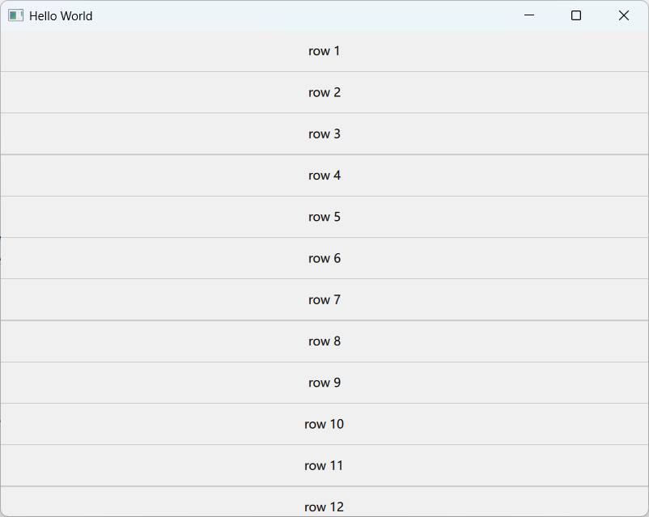
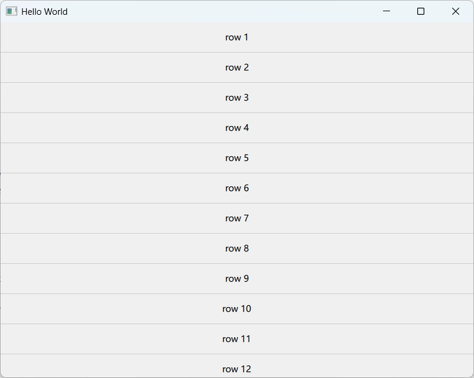

# Delegate分割线粗细不均匀的问题

## 问题描述

在开发过程中，使用一个ListView创建若干Delegate，每个Delegate内部包含一个高度为1的分割线。尽管指定的分割线高度均为1，但实际显示时发现分割线粗细不均匀。

## 示例代码

```qml
ListView {
    id: listView
    anchors.fill: parent
    model: 20
    
    delegate: Column {
        width: listView.width
        
        Rectangle {
            width: parent.width
            height: 40
            color: "#f0f0f0"
            
            Text {
                anchors.centerIn: parent
                text: "row " + (index + 1)
            }
        }
        
        Rectangle {
            width: parent.width
            height: 1
            color: "#cccccc"
            visible: index < listView.count - 1
        }
    }
}
```

发现尽管指定的分割线高度均为1，但是显示的粗细不均匀，如下图：



## 原因分析

这个问题的根本原因在于高DPI显示和系统缩放设置的影响。当Windows系统设置了125%的显示缩放时，逻辑像素与物理像素之间存在1:1.25的比例关系。

由于我们设置的分割线高度为1个逻辑像素，实际对应的物理像素高度为1.25。然而，屏幕只能以整数个物理像素进行渲染，Qt渲染引擎会对这些小数部分进行处理：

1. 对于单个分割线，1.25个物理像素会被舍入为1个物理像素显示
2. 当多个分割线连续排列时，这些小数部分(0.25)会在内部累加
3. 每累积到4个分割线(4×0.25=1)，额外的1个物理像素就会被添加到渲染中
4. 因此每隔几个分割线，就会出现一条2像素高的分割线，造成视觉上的不均匀

## 解决方法

为了兼容用户对缩放率的设置，设定delegate这类重复对象的高度时，应该使用`Screen.devicePixelRatio`来保证实际的物理像素为1。

```
height: 1 / Screen.devicePixelRatio
```


